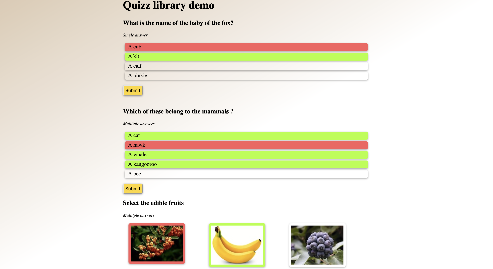

# Quizz builder

This repo contains a little library to build quizzes in JavaScript, to be embeded in any website.

# Using it

This tool is meant to be a very simple library: you can simply include the [src/quizz_library.js](src/quizz_library.js) (and optionally the css) in you project, and use it in you HTML like so:
```html
<div id="1" class="one-answer-quizz answer-quizz flex flex-col">
    <h3>What is the name of the baby of the fox?</h3>
    <div id="quizz-content"></div>  <!-- Will be filled by the library -->
    <button class="submit-quizz">Submit</button>
    <script >
        {
            let quizzId = 1
            let choices = quizz.parseInput(`
            - [ ] A cub
            - [x] A kit
            - [ ] A cat
            `)
            quizz.storeQuizz(quizzId, choices)
            let quizz_div = document.getElementById(quizzId).getElementsByTagName("div")[0]
            quizz.buildSingleChoiceQuizz(quizzId, quizz_div, choices)
        }
    </script>
</div>
```

The [src/quizz_library.css](src/quizz_library.css) provides default CSS styling, with animations when answers are chosen and revealed, but you can override any class you want with you own styling.


# Demo

A demo is available in [demo/index.html](demo/index.html). Simply clone the repository and open the file to view it and interact with the quizz.

